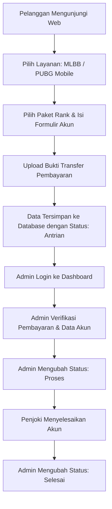

# 🎮 Javapedia - Platform Jasa Joki Game Online Terpercaya

<div align="center">
  
  
  <p align="center">
    <strong>Website Penyedia Layanan Joki Game PUBG Mobile & Mobile Legends Profesional, Cepat, dan Aman.</strong>
  </p>

  <p align="center">
    
    
    
    
    
    
  </p>
</div>

---

## 📌 Daftar Isi
1. [Tentang Proyek](#-tentang-proyek)
2. [Fitur Unggulan](#-fitur-unggulan)
3. [Tech Stack](#-tech-stack)
4. [Struktur Direktori](#-struktur-direktori)
5. [Skema Database](#-skema-database)
6. [Prasyarat Sistem](#-prasyarat-sistem)
7. [Panduan Instalasi & Menjalankan Aplikasi](#-panduan-instalasi--menjalankan-aplikasi)
8. [Akses Akun Default](#-akses-akun-default)
9. [Alur Pemesanan & Alur Kerja](#-alur-pemesanan--alur-kerja)
10. [Lisensi & Kontribusi](#-lisensi--kontribusi)

---

## 📖 Tentang Proyek

**Javapedia** adalah aplikasi berbasis web yang dirancang khusus untuk memfasilitasi kebutuhan layanan jasa joki game online populer, terutama **Mobile Legends: Bang Bang (MLBB)** dan **PUBG Mobile**. 

Aplikasi ini memiliki 2 bagian utama:
1. **Portal Publik (Customer Interface)**: Tempat pengguna melihat katalog layanan paket rank, harga, event promo, testimoni pelanggan, serta formulir pemesanan dengan upload bukti pembayaran.
2. **Panel Admin (Back-Office Dashboard)**: Tempat administrator mengelola antrean pesanan, melihat detail akun joki yang dipesan, memvalidasi bukti pembayaran, serta mengubah status pesanan (*Antrian* $\rightarrow$ *Proses* $\rightarrow$ *Selesai*).

---

## ✨ Fitur Unggulan

### 👤 Pengunjung / Klien (Customer Side)
- **Beranda Interaktif**: Tampilan modern, responsif, dan dinamis dengan navigasi yang mudah.
- **Katalog Joki Mobile Legends**:
  - Pilihan paket rank lengkap (Grandmaster, Epic, Legend, Mythic, Mythic Honor, Mythic Glory, hingga Mythic Immortal).
  - Formulir pemesanan komprehensif: tipe login (Moonton, VK, FB, TikTok), ID & Server, email/kontak, password, request hero spesifik, dan catatan tambahan.
  - Unggah bukti transfer/pembayaran langsung ke server.
- **Katalog Joki PUBG Mobile**:
  - Pilihan paket tier (Bronze, Silver, Gold, Platinum, Crown, Ace, Ace Master, Ace Dominator, Conqueror).
  - Formulir pemesanan dengan dukungan berbagai metode login (Twitter, Facebook, Google Play, VK, Nomor Telepon).
  - Bukti transaksi terunggah aman.
- **Halaman Event & Promo**: Info turnamen khusus dan event joki musiman.
- **Testimoni & Review**: Galeri bukti kepuasan pelanggan dan hasil pengerjaan joki.
- **Informasi Kontak & Layanan**: Terhubung langsung dengan customer service via WhatsApp & media sosial.

### 🛡️ Administrator (Admin Side)
- **Sistem Autentikasi**: Proteksi session login admin yang aman.
- **Dashboard Statistik**: Ringkasan jumlah pesanan dan status transaksi.
- **Manajemen Pesanan Mobile Legends**:
  - Tabel data pesanan lengkap (ID Akun, Metode Login, Email, Password, Request Hero, Catatan, Paket).
  - Fitur pencarian pesanan berdasarkan ID / Nickname secara cepat.
  - Preview bukti struk transfer / bukti pembayaran pelanggan.
  - Update status pengerjaan (*Antrian*, *Proses*, *Selesai*).
  - Fitur hapus pesanan yang sudah selesai atau tidak valid.
- **Manajemen Pesanan PUBG Mobile**:
  - Pengelolaan data akun dan orderan PUBG Mobile secara terstruktur.
  - Fitur pencarian, update status, dan penghapusan data order.

---

## 💻 Tech Stack

- **Backend**: PHP Native (Procedural & Modular Architecture)
- **Database**: MySQL / MariaDB
- **Frontend**:
  - HTML5 & CSS3 (Custom Glassmorphism & Modern Gaming Theme)
  - JavaScript (Vanilla JS untuk dynamic interactive navbar & elements)
  - Framework CSS: Bootstrap 4 / 5 & SB Admin 2 Styles
  - Iconography: Remix Icon & Font Awesome 5/6
- **Server Environment**: Apache HTTP Server (XAMPP / Laragon / LAMP)

---

## 📂 Struktur Direktori

```text
javapedia/
├── admin/                     # Modul Panel Admin
│   ├── admin.php              # Halaman index/redirect admin
│   ├── beranda2.php           # Dashboard utama admin
│   ├── dataml.php             # Manajemen pesanan Mobile Legends
│   ├── data_pubg.php          # Manajemen pesanan PUBG Mobile
│   ├── delete_akunml.php      # Skrip hapus data order ML
│   ├── delete_akunpubg.php    # Skrip hapus data order PUBG
│   ├── function1.php          # Fungsi helper CRUD PUBG
│   ├── function2.php          # Fungsi helper CRUD ML
│   ├── simpan_prosesml.php    # Handler update status ML
│   └── simpan_prosespubg.php  # Handler update status PUBG
├── assets/                    # Asset gambar, banner hero, & logo
├── assets1/                   # Library FontAwesome & resource tambahan
├── components/                # Komponen antarmuka modular
│   ├── meta.php               # Meta tag SEO & responsive viewport
│   ├── navbar.php             # Navigasi utama dengan auto-detect BASE_URL
│   └── footer.php             # Footer navigasi & hak cipta
├── css/                       # Stylesheet tampilan web & komponen
├── fotoml/                    # Direktori penyimpanan upload bukti bayar ML
├── fotopubg/                  # Direktori penyimpanan upload bukti bayar PUBG
├── includes2/                 # Komponen layout dashboard admin
│   ├── header.php             # Header dashboard
│   ├── navbar.php             # Navbar atas dashboard
│   └── sidebar.php            # Navigasi menu samping dashboard
├── js/                        # Script interaktif JavaScript
├── Login/                     # Template asset halaman login
├── pages/                     # Halaman informasi & alur pemesanan
│   ├── info/                  # Halaman informasi (about, contact, event, home, testi)
│   ├── infoorder/             # Halaman pemilihan paket joki (ml.php, pubg.php)
│   └── orders/                # Formulir order & proses simpan orderan
├── about.php                  # Halaman tentang Javapedia
├── config.php                 # Konfigurasi BASE_URL dinamis (localhost/hosting)
├── index.php                  # Landing page utama publik
├── index2.php                 # Form login portal admin
├── java (1).sql               # Database dump skema & data awal
├── koneksi.php                # Pengaturan koneksi database MySQL
├── login2.php                 # Skrip autentikasi login admin
├── .gitignore                 # Filter git ignore
└── README.md                  # Dokumentasi proyek
```

---

## 🗄️ Skema Database

File database disertakan pada root direktori: `java (1).sql`.

### 1. Tabel `admin`
Menyimpan kredensial administrator sistem:
| Kolom | Tipe Data | Keterangan |
| :--- | :--- | :--- |
| `id_admin` | INT(11) | Primary Key, Auto Increment |
| `username` | VARCHAR(200) | Username login admin |
| `password` | VARCHAR(200) | Password akun admin |
| `level` | ENUM('admin') | Hak akses role |
| `nama` | VARCHAR(200) | Nama lengkap administrator |

### 2. Tabel `data_ml`
Menyimpan data transaksi dan detail akun joki Mobile Legends:
| Kolom | Tipe Data | Keterangan |
| :--- | :--- | :--- |
| `id_ml` | INT(11) | Primary Key, Auto Increment |
| `login_ml` | VARCHAR(200) | Tipe login (Moonton, VK, FB, TikTok) |
| `userid_ml` | VARCHAR(200) | ID & Server akun MLBB |
| `email_ml` | VARCHAR(222) | Email / No. HP akun |
| `pw_ml` | VARCHAR(200) | Password akun joki |
| `req_hero` | VARCHAR(200) | Request hero khusus dari pelanggan |
| `note_ml` | VARCHAR(200) | Catatan tambahan |
| `foto_ml` | VARCHAR(200) | Nama berkas bukti pembayaran di folder `fotoml/` |
| `paket_ml` | VARCHAR(200) | Paket rank yang dipesan beserta nominal |
| `status` | ENUM | Status: `antrian`, `proses`, `selesai` |

### 3. Tabel `data_pubg`
Menyimpan data pesanan joki PUBG Mobile:
| Kolom | Tipe Data | Keterangan |
| :--- | :--- | :--- |
| `id_pubg` | INT(11) | Primary Key, Auto Increment |
| `login_pubg` | VARCHAR(200) | Tipe login (VK, Twitter, FB, No Telp) |
| `email_pubg` | VARCHAR(200) | Email / Username / Telepon |
| `userid_pubg` | VARCHAR(200) | ID Karakter & Nickname PUBG |
| `pw_pubg` | VARCHAR(200) | Password akun |
| `foto_pubg` | VARCHAR(200) | Nama berkas bukti pembayaran di folder `fotopubg/` |
| `paket_pubg` | VARCHAR(200) | Paket tier yang dipilih |
| `status` | ENUM | Status: `antrian`, `proses`, `selesai` |

---

## ⚙️ Prasyarat Sistem

Sebelum menjalankan aplikasi, pastikan komputer Anda telah terinstal:
- **Web Server Stack**: [XAMPP](https://www.apachefriends.org/) / [Laragon](https://laragon.org/) / LAMP
- **PHP**: Versi 7.3 - 8.x
- **MySQL / MariaDB**: Versi 10.4 atau lebih baru
- **Web Browser**: Google Chrome, Mozilla Firefox, Microsoft Edge, dll.
- **Git** (Opsional, untuk clone repository)

---

## 🚀 Panduan Instalasi & Menjalankan Aplikasi

### 1. Clone atau Unduh Repositori
Tempatkan folder proyek ke dalam direktori web server lokal:
- **XAMPP**: `C:/xampp/htdocs/jp`
- **Laragon**: `C:/laragon/www/jp`

```bash
git clone https://github.com/iannnub/javapedia.git jp
```

### 2. Nyalakan Service Apache & MySQL
Buka **XAMPP Control Panel**, kemudian klik tombol **Start** pada modul **Apache** dan **MySQL**.

### 3. Konfigurasi Database
1. Buka browser dan akses **phpMyAdmin**: [http://localhost/phpmyadmin](http://localhost/phpmyadmin).
2. Buat database baru dengan nama `java`:
   ```sql
   CREATE DATABASE java;
   ```
3. Pilih database `java`, lalu pilih tab **Import**.
4. Klik **Choose File**, pilih file `java (1).sql` yang berada di dalam folder proyek, lalu klik **Import / Go**.

### 4. Verifikasi Koneksi Database
Buka file `koneksi.php`, pastikan konfigurasi sesuai dengan environment lokal Anda:
```php
<?php
$koneksi = mysqli_connect("localhost", "root", "", "java");
?>
```

### 5. Akses Aplikasi
- **Halaman Pengunjung (Utama)**:  
  👉 [http://localhost/jp/](http://localhost/jp/)
- **Halaman Login Admin**:  
  👉 [http://localhost/jp/index2.php](http://localhost/jp/index2.php)

---

## 🔑 Akses Akun Default

Berikut kredensial default untuk mengakses panel admin:

| Username | Password | Role |
| :--- | :--- | :--- |
| `admin1` | `admin1` | Administrator |
| `admin2` | `admin2` | Administrator |

---

## 🔄 Alur Pemesanan & Alur Kerja



---

## 👥 Kontribusi

Kontribusi selalu terbuka untuk pengembangan Javapedia:
1. Fork repository ini
2. Buat branch fitur baru (`git checkout -b feature/FiturKeren`)
3. Commit perubahan Anda (`git commit -m 'Menambahkan fitur keren'`)
4. Push ke branch Anda (`git push origin feature/FiturKeren`)
5. Ajukan **Pull Request**

---

## 📄 Lisensi & Hak Cipta

Dikelola dan dikembangkan oleh **[iannnub](https://github.com/iannnub)**.  
Proyek ini dibuat untuk tujuan pembelajaran, portofolio, dan layanan jasa joki game online.
